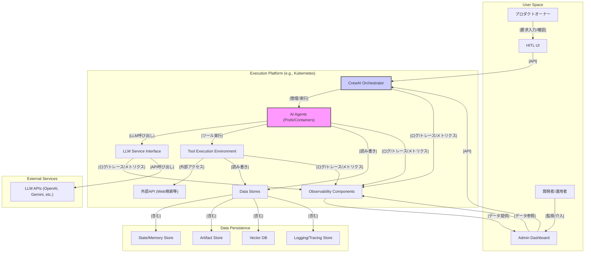

# 包括的仕様書: Webシステム開発AIエージェントチーム

## 1. はじめに

本文書は、ユーザーの要求に基づき、MGX.devを参考としたWebシステム開発を目的とするAIエージェントチームの包括的な仕様を定義します。CrewAIフレームワークを技術基盤とし、動的かつ拡張可能なチーム構成、技術要件、システムアーキテクチャ、および段階的な実装ロードマップを示します。

このAIエージェントチームは、プロダクトオーナー（人間）との対話を通じて要求を受け取り、PdM、PM、デザイナー、PL、エンジニア、テスターといった役割を持つAIエージェントが協調してWebシステムの設計、実装、テストを行います。プロジェクトの負荷に応じてエージェント数を動的に調整し、効率的な開発プロセスを実現することを目指します。

本文書は、以下の個別ドキュメントを統合・整理したものです。

- AIエージェントチーム構造仕様書 (`team_structure_spec.md`)
- 技術要件定義書 (`technical_requirements_draft.md`)
- システムアーキテクチャ設計書 (`system_architecture_design.md`)
- 実装ロードマップ (`implementation_roadmap_draft.md`)

---

## 2. AIエージェントチーム構造仕様

## 2.1 概要

本仕様書は、MGX.devを参考にWebシステム開発を行うAIエージェントチームの構造を定義するものです。ユーザーの要求に基づき、動的かつ拡張可能なチーム構成を目指します。技術スタックとしてはCrewAIフレームワークの採用を前提とし、ロールベースのアーキテクチャに基づき各エージェントの役割と連携を定義します。

## 2.2 チーム構成の基本方針

- **役割ベース:** 各エージェントは明確な役割と責任を持つ。
- **動的構成:** プロジェクトの要求に応じて、特定の役割（特にエンジニア、テスター）のエージェント数を動的に増減させる。
- **協調:** エージェント間の連携プロセスを定義し、効率的な開発フローを実現する。
- **拡張性:** 将来的に新しい役割や専門エージェントを追加可能な設計とする。
- **人間との連携:** プロダクトオーナー（人間）がPdMエージェントと対話し、要求を入力するインターフェースを想定する。

## 2.3 エージェントの役割定義

以下に、本チームを構成する主要なAIエージェントの役割と責任を定義します。

- **プロダクトオーナー (User/Human):**
    - **責任:** 開発対象となるWebシステムのビジョン、目標、主要な要求を定義する。
    - **連携:** PdMエージェントと対話し、要求を入力・ уточнение する。
- **PdM (Product Manager Agent):**
    - **責任:** プロダクトオーナーからの要求を理解・分析し、具体的なプロダクトバックログ項目に落とし込む。要求の優先順位付けを行う。市場調査や競合分析を行い、プロダクト戦略を支援する。
    - **連携:** プロダクトオーナーと対話し、要求を明確化する。PMエージェントにプロダクトバックログと優先順位を伝達する。
- **PM (Project Manager Agent):**
    - **責任:** プロジェクト全体の計画立案、タスク分解、スケジュール管理、進捗監視、リスク管理を行う。各エージェントへのタスク割り当てと連携調整を担当する。開発リソース（エンジニア、テスターエージェント数）の動的な調整判断を行う。
    - **連携:** PdMエージェントからプロダクトバックログを受け取る。デザイナー、PL、エンジニア、テスターエージェントにタスクを指示し、進捗報告を受ける。必要に応じてAIアーキテクト、プロンプトエンジニア、データエンジニアを招集・連携する。
- **デザイナー (Designer Agent):**
    - **責任:** PMエージェントからの指示に基づき、ユーザーインターフェース（UI）およびユーザーエクスペリエンス（UX）のデザイン仕様を作成する。ワイヤーフレーム、モックアップ、プロトタイプを作成する。
    - **連携:** PMエージェントからタスク指示を受ける。PLエージェントとデザイン仕様について連携する。
- **PL (Project Lead / Tech Lead Agent):**
    - **責任:** PMエージェントからの指示とデザイナーエージェントのデザイン仕様に基づき、システムの機能仕様、技術仕様、アーキテクチャ設計（AIアーキテクト不在時）を作成する。実装タスクをエンジニアエージェントに割り当てる。コードレビューや技術的な意思決定を行う。
    - **連携:** PMエージェントからタスク指示を受ける。デザイナーエージェントとデザイン仕様について連携する。エンジニアエージェントに実装指示を行い、進捗を確認する。テスターエージェントにテスト観点を指示する。必要に応じてAIアーキテクト、プロンプトエンジニア、データエンジニアと連携する。
- **エンジニア (Engineer Agent):**
    - **責任:** PLエージェントからの指示に基づき、担当機能のコーディング、単体テスト、デバッグを行う。技術的な課題解決に取り組む。
    - **連携:** PLエージェントから実装指示を受け、進捗や課題を報告する。他のエンジニアエージェントと協力する。
    - **備考:** PMエージェントの判断により、プロジェクトの負荷に応じて動的に増減する。
- **テスター (Tester Agent):**
    - **責任:** PL/PMエージェントからの指示に基づき、テスト計画、テストケースを作成し、テストを実行する。バグ報告と再現手順の記録を行う。自動テストコードを作成・実行する。
    - **連携:** PL/PMエージェントからテスト指示を受け、テスト結果やバグ情報を報告する。エンジニアエージェントとバグ修正について連携する。
    - **備考:** PMエージェントの判断により、プロジェクトの負荷に応じて動的に増減する。

## 2.4 補助的な専門エージェント（初期はPM/PLが兼務、必要に応じて導入検討）

- **AIアーキテクト (AI Architect Agent):**
    - **責任:** システム全体の技術アーキテクチャ設計、特にAI/MLコンポーネントに関する技術選定、スケーラビリティ、セキュリティ設計を担当する。
    - **連携:** PM/PLエージェントからの要請に基づき、設計支援やレビューを行う。
- **プロンプトエンジニア (Prompt Engineer Agent):**
    - **責任:** 各AIエージェントが使用する大規模言語モデル（LLM）への指示（プロンプト）の設計、最適化、評価を行う。エージェントの応答精度や効率を向上させる。
    - **連携:** PM/PLエージェントからの要請に基づき、特定のエージェントのプロンプト改善を行う。
- **データエンジニア (Data Engineer Agent):**
    - **責任:** AIモデルの学習やシステム開発に必要なデータの収集、クレンジング、前処理、管理を行う。データパイプラインを構築・運用する。
    - **連携:** PM/PLエージェントからの要請に基づき、必要なデータを提供する。

**備考:** これらの専門エージェントは、初期フェーズではPM/PLエージェントが役割を兼務し、プロジェクトの進行に伴い必要性が明確になった段階で、個別に導入することを検討します。

## 2.5 連携プロセス（CrewAIにおける想定）

CrewAIフレームワークを用いて、以下のプロセスで開発を進めることを想定します。

1. **要求定義:** プロダクトオーナーがPdMエージェントに要求を入力。
2. **計画立案:** PdMがバックログを作成し、PMが計画・タスク分解を行う。
3. **設計:** PMがデザイナーにUI/UX設計を指示。PLが機能・技術仕様を作成。
4. **実装:** PLがエンジニアに実装タスクを指示。
5. **テスト:** PM/PLがテスターにテストを指示。
6. **レビューと反復:** 各工程でPM/PLがレビューを行い、フィードバックを反映させながら反復的に開発を進める。
7. **動的調整:** PMは進捗や負荷状況に応じて、エンジニア/テスターエージェントの数を調整する。

各エージェント間の具体的なタスク割り当てや情報共有の方法は、CrewAIのTaskおよびProcess定義を用いて詳細化します。

## 2.5.1 専門エージェントとコアエージェントの連携プロセス

専門エージェント（AIアーキテクト、プロンプトエンジニア、データエンジニア）とコアエージェント（PdM、PM、デザイナー、PL、エンジニア、テスター）の連携は、以下の原則とプロセスに基づいて行われます。

### 連携の基本方針

- **依頼ベースの協働**: コアエージェントは必要に応じて専門エージェントに特定の専門タスクを依頼します。
- **非同期処理**: 専門エージェントはタスクを独立して処理し、結果をコアエージェントに返却します。
- **知識共有**: 専門知識や成果物はベクトルデータベースに保存され、全エージェントがアクセス可能です。

### 専門エージェント起動条件

#### AIアーキテクトエージェント
- PLからの要請：アーキテクチャ設計、技術スタック選定時
- PMからの要請：プロジェクト計画段階、技術的リスク評価時
- エンジニアからの要請：複雑なAI実装時

#### プロンプトエンジニアエージェント
- 全コアエージェントからの要請：プロンプト最適化が必要な場合
- PLからの要請：LLM関連機能実装時
- テスターからの要請：LLM機能のテスト精度向上時

#### データエンジニアエージェント
- PLからの要請：データパイプライン設計時
- エンジニアからの要請：データ処理・変換実装時
- テスターからの要請：データ品質検証時

### 連携ワークフロー

1. **起動フロー**:
   - コアエージェントが専門知識を要するタスクを特定
   - PMが専門エージェント起動を承認（リソース管理のため）
   - PMがタスク優先度と期限を設定

2. **タスク実行フロー**:
   - 専門エージェントがタスクを受領・分析
   - 必要に応じて追加情報をコアエージェントに要求
   - タスク実行と成果物生成
   - 結果と推奨事項をコアエージェントに返却

3. **結果統合フロー**:
   - コアエージェントが成果物を評価
   - 必要に応じて調整や追加タスクを依頼
   - 最終成果物をプロジェクト成果物に統合

### 具体的な連携シナリオ

#### シナリオ1: アーキテクチャ設計
1. PMが要件をPdMと確認後、PLにシステム設計を指示
2. PLが複雑なAIシステム設計が必要と判断
3. PLがPMに専門家起動を要請、PMが承認
4. AIアーキテクトが設計案を作成、PLに提出
5. PLが設計案を評価・調整し、最終設計を確定
6. PLがエンジニアに実装指示

#### シナリオ2: プロンプト最適化
1. エンジニアがLLM機能実装中に応答精度の問題を特定
2. エンジニアがPLに報告、PLがプロンプト最適化の必要性を判断
3. PLがプロンプトエンジニアに最適化を依頼
4. プロンプトエンジニアが最適化案を作成、テスト結果と共に提出
5. エンジニアが実装に統合

#### シナリオ3: データパイプライン構築
1. PLがデータ処理の要件をエンジニアに伝達
2. エンジニアが複雑なデータ処理が必要と判断
3. エンジニアがデータエンジニアの支援を要請
4. データエンジニアがパイプライン設計と実装支援
5. エンジニアとテスターがパイプラインを検証

### 通信プロトコル

専門エージェントとコアエージェント間の通信は以下の標準形式で行われます：

```json
{
  "request_id": "一意のID",
  "sender": "依頼元エージェント",
  "recipient": "専門エージェント",
  "task_type": "タスク種別",
  "priority": "優先度",
  "deadline": "期限",
  "description": "タスク詳細説明",
  "context": {
    "関連情報": "値"
  },
  "attachments": ["関連ファイルパス"]
}
```

### モニタリングと管理

- PMが専門エージェント活用状況を監視
- タスク実行状況のダッシュボード提供
- 専門エージェントのパフォーマンス評価とフィードバック

## 2.6 今後の拡張

将来的には、セキュリティ専門エージェント、インフラ専門エージェント、特定の技術領域（例：データベース、フロントエンドフレームワーク）に特化したエンジニアエージェントなどを追加し、チームの能力を拡張することが可能です。

---

## 3. 技術要件定義

## 3.1 概要

本文書は、CrewAIフレームワークを基盤とし、`team_structure_spec.md`で定義されたAIエージェントチームを用いてWebシステム開発（MGX.dev参考）を行うための技術要件を定義します。拡張性、保守性、パフォーマンス、セキュリティを考慮したシステム構築を目指します。

## 3.2 全体アーキテクチャ方針

- **フレームワーク:** CrewAIを中核とし、エージェントの定義、タスク管理、プロセス実行を行います。
- **言語:** Pythonを主要開発言語とします。
- **実行環境:** クラウドベースのコンテナ環境（例: Docker, Kubernetes）での実行を推奨します。これにより、スケーラビリティとポータビリティを確保します。
- **モジュール性:** 各エージェントやツールは独立したモジュールとして開発し、疎結合なアーキテクチャを目指します。

## 3.3 開発環境要件

- **プログラミング言語:** Python 3.10以降
- **主要ライブラリ/フレームワーク:**
    - CrewAI (および依存ライブラリ)
    - LangChain (CrewAIが内部で利用、必要に応じて直接利用も検討)
    - Webフレームワーク (開発対象のWebシステムに応じて選択。例: FastAPI, Flask, Django)
    - データベースORM (例: SQLAlchemy)
    - テストフレームワーク (例: pytest)
- **バージョン管理:** Git (例: GitHub, GitLab)
- **パッケージ管理:** pip, Poetry, or Conda
- **IDE:** 開発者が選択可能 (例: VS Code, PyCharm)

## 3.4 AIモデル要件

- **大規模言語モデル (LLM):**
    - 初期の主要LLMとして**GPT-4o**を使用します。ただし、将来的な切り替えや他のモデル（例: Gemini-1.5 Pro, Claude 3 Opus, OSSモデル）の併用も可能な設計とします。APIアクセスを基本とします。
    - 各エージェントの役割やタスクに応じて、最適なLLMを割り当てられる設計とします。
    - プロンプトエンジニアリングによる性能最適化を前提とします。
- **埋め込みモデル (Embedding Models):**
    - 情報検索や類似性評価のために、高性能な埋め込みモデル（例: OpenAI text-embedding-ada-002, Voyage AI, OSSモデル）を利用可能であること。
- **モデル管理:** モデルAPIキーや設定情報を安全に管理する仕組み（初期は**.envファイル**、将来的にはGCP Secret Manager等の利用を検討）を導入します。

## 3.5 インフラストラクチャ要件

- **クラウドプロバイダー:** **Google Cloud Platform (GCP)** を主要なクラウドプロバイダーとして利用します。
- **コンピュート (CrewAIコア):**
    - CrewAIのオーケストレーションおよびエージェントプロセスは、**GCP Google Kubernetes Engine (GKE)** 上でコンテナとして実行します。これにより、スケーラビリティと信頼性を確保します。
    - LLM API呼び出しが主となるため、API連携のレイテンシとスループットを考慮します。
    - 必要に応じて、特定のタスク用にGKE上でGPUノードプールを利用可能とします。
- **コンピュート (HITL UI):**
    - Human-in-the-LoopのためのWeb UI（フロントエンドおよび軽量バックエンドAPI）は **Vercel** にデプロイします。
- **ストレージ:**
    - **プライマリデータベース:** エージェントの状態、短期記憶、設定情報などの永続化には、**Neon** (PostgreSQL互換サーバーレスDB) を利用します。
    - **アーティファクトストレージ:** 生成されたコード、ドキュメント、デザイン案などの成果物は **GCP Google Cloud Storage (GCS)** に保存します。
    - **ベクトルデータベース:** RAG（検索拡張生成）のためにドキュメントや過去の情報をベクトル化して保存・検索します。具体的なサービス（例: Pinecone, Weaviate, ChromaDB、またはNeonの拡張機能）は詳細設計時に選定します。
    - **ログ/トレースストレージ:** オブザーバビリティデータを保存します（後述）。
- **ネットワーク:**
    - 外部API（LLM API, Web検索API等）への安定した接続を確保します (GCP Cloud NAT等)。
    - GKEクラスタ内のエージェント間通信、およびVercelとGKE間のAPI通信のためのネットワーク設定を行います (GCP VPC, GKE Services, Vercel Network)。
    - セキュリティを考慮したネットワーク構成（VPC, ファイアウォールルール, GKE Network Policies）を実装します。

## 3.6 ツール要件

- **Web検索:** エージェントが最新情報にアクセスするためのWeb検索ツール（例: Google Search API, Serper API）連携。
- **コード実行:** エンジニアエージェントがコードを安全に実行・テストするためのサンドボックス環境（例: Dockerコンテナ）。
- **ファイルI/O:** エージェントがファイル（ドキュメント、コード、設定ファイル等）を読み書きするための機能。
- **データベースアクセス:** システムが必要とするデータベースへのアクセス機能。
- **カスタムツール:** プロジェクト固有のタスクを実行するためのカスタムツール開発インターフェース（CrewAIのTool機能を利用）。

## 3.7 データ要件

- **データソース:** プロジェクトに必要なデータソース（データベース、API、ファイル等）へのアクセス。
- **データ永続化:** エージェントの記憶、会話履歴、生成物などを適切に永続化する。
- **データセキュリティ:** 機密情報や個人情報を含むデータを安全に取り扱うための暗号化、アクセス制御。
- **データプライバシー:** 関連法規（GDPR等）を遵守したデータ取り扱い。

## 3.8 セキュリティ要件

- **APIキー管理:** LLMや外部サービスのAPIキーは、PoC段階では **.envファイル** を用いて管理します。将来的にはGCP Secret Manager等の利用を検討します。
- **アクセス制御:** 各エージェントやツールへのアクセス権限を適切に管理します（GCP IAM等を利用）。
- **入力サニタイズ:** 外部からの入力（特にユーザー入力やWebコンテンツ）に対するサニタイズを行い、プロンプトインジェクション等の攻撃を防ぎます。
- **サンドボックス:** コード実行環境を適切にサンドボックス化し（Docker等）、悪意のあるコード実行リスクを低減します。
- **通信暗号化:** 外部APIとの通信、VercelとGKE間の通信、およびユーザーとの通信は **HTTPSを必須** とし、暗号化します。
- **脆弱性対策:** 使用するライブラリやフレームワークの脆弱性情報を定期的にチェックし、アップデートを行います。
- **その他:** 本プロジェクトは初期段階（PoC）であるため、上記以外のセキュリティ要件は現時点では最小限としますが、本格運用時には包括的なセキュリティレビューと対策強化が必要です。

## 3.9 スケーラビリティとパフォーマンス要件

- **エージェントのスケーリング:** PMエージェントの判断に基づき、エンジニアやテスターエージェントのインスタンス数を動的に増減できる設計とする（コンテナオーケストレーション活用）。
- **非同期処理:** 時間のかかるタスク（LLM呼び出し、外部APIアクセス等）は非同期処理とし、システム全体の応答性を維持する。
- **負荷分散:** 必要に応じてロードバランサーを導入し、エージェントプロセスへの負荷を分散する。
- **パフォーマンス監視:** システムの応答時間、リソース使用率、API呼び出し回数などを監視し、ボトルネックを特定・改善する。

## 3.10 連携・統合要件

- **外部API連携:** 開発に必要な外部サービス（バージョン管理、CI/CD、監視ツール、コミュニケーションツール等）とのAPI連携。
- **MCP (Multi-Agent Communication Protocol) 互換性:** 将来的な標準プロトコルへの対応を見据え、エージェント間通信のインターフェース設計において、MCPの概念（メッセージ形式、役割、会話管理等）を参考にし、互換性を意識する。
- **MGX.devとの連携（参考）:** MGX.devが提供する機能（もしあれば）との連携可能性を考慮する。

## 3.11 オブザーバビリティ（可観測性）要件

- **ロギング:** 各エージェントの動作、タスク実行状況、エラー、LLMとの対話履歴などを詳細に記録する構造化ロギングを導入する。
- **トレーシング:** エージェント間のタスク連携や処理フローを追跡可能にする分散トレーシングを導入する（例: OpenTelemetry）。
- **モニタリング:** システム全体の健全性、パフォーマンスメトリクス、リソース使用状況、APIエラーレートなどを監視するダッシュボードを構築する（例: Prometheus, Grafana, Datadog）。
- **アラート:** 事前に定義した閾値を超えた場合や、重大なエラー発生時に通知するアラートシステムを導入する。

## 3.12 Human-in-the-loop (HITL) 設計要件

- **介入ポイント:**
    - **必須介入:** PdMエージェントによる要求定義・分析が完了し、開発タスクに落とし込む前の**PdMレビュー完了時**に、プロダクトオーナー（人間）による確認・承認を必須とします。
    - **条件付き介入:** プロジェクト進行中に、以下のような重要判断が必要な場合に、PMエージェントがプロダクトオーナーまたは開発者（人間）に確認・承認を求めます。
        - 当初の仕様からの大幅な変更が必要と判断された場合。
        - 予期せぬ技術的課題により、実装方針の変更が必要な場合。
        - LLM利用料など、運用コストが想定を大幅に超える見込みとなった場合。
        - セキュリティ上の重大な懸念が発見された場合。
        - その他、PMエージェントが人間の判断を必要と判断した場合。
- **インターフェース:**
    - **プロダクトオーナー向け:** PdMエージェントとの要求定義・確認、および必須/条件付き介入時の承認を行うためのインターフェース。**Vercel上に構築されるWeb UI**を主とし、補助的にチャットインターフェース（例: Slack連携）も検討します。
    - **開発者/運用者向け:** エージェントの動作状況監視、ログ確認、パフォーマンスモニタリング、および必要に応じた手動介入（タスク停止、パラメータ調整等）が可能な管理ダッシュボード。これも**Vercel**または**GCP**上で構築します。

## 3.13 その他

- **ドキュメンテーション:** 設計、API仕様、運用手順などを継続的にドキュメント化する。
- **テスト:** 単体テスト、結合テスト、E2Eテストを自動化し、品質を担保する。

---

## 4. システムアーキテクチャ設計

## 4.1 概要

本文書は、CrewAIフレームワークを基盤とするWebシステム開発AIエージェントチームのシステムアーキテクチャを定義します。`team_structure_spec.md`、`technical_requirements_draft.md`、`implementation_roadmap_draft.md`に基づき、主要コンポーネント、データフロー、連携方式を明確にします。

## 4.2 アーキテクチャ原則

- **モジュール性:** 各コンポーネント（エージェント、ツール、データストア）は疎結合とし、交換・拡張を容易にする。
- **スケーラビリティ:** 主要な処理（特にエージェント実行）は水平スケーリング可能とする。
- **オブザーバビリティ:** システム全体の動作を監視・追跡可能にする。
- **セキュリティ:** APIキー管理、アクセス制御、データ保護を考慮する。
- **柔軟性:** LLMやツールの切り替え・追加が容易な設計とする。

## 4.3 主要コンポーネント

以下に主要なコンポーネントを示します。

- **CrewAI Orchestrator:**
    - CrewAIフレームワークの中核。エージェント（Agents）、タスク（Tasks）、プロセス（Process）を管理・実行する。
    - エージェント間のタスク割り当て、実行順序制御、LLM呼び出し、ツール利用をオーケストレーションする。
- **AI Agents (CrewAI Agents):**
    - `team_structure_spec.md`で定義された各役割（PdM, PM, Designer, PL, Engineer, Tester, AI Architect, Prompt Engineer, Data Engineer）を持つエージェント。
    - それぞれが特定の目標（Goal）、背景（Backstory）、利用可能なツール（Tools）、LLM設定を持つ。
    - PMエージェントは、負荷に応じてEngineer/Testerエージェントのインスタンス数を動的に調整するロジックを持つ（Orchestratorと連携）。
- **LLM Service Interface:**
    - 各種LLM API（OpenAI, Gemini, Claude等）への統一的なインターフェースを提供するモジュール。
    - APIキー管理、リクエスト/レスポンス処理、エラーハンドリング、リトライロジックを含む。
    - エージェントごとに使用するLLMを切り替え可能にする。
- **Tool Execution Environment:**
    - エージェントが利用する各種ツール（Web検索、コード実行、ファイルI/O、DBアクセス等）を実行する環境。
    - **Code Execution Sandbox:** Dockerコンテナ等を利用し、安全にコードを実行・テストする隔離環境。
    - **Web Search Tool:** 外部API（Serper等）を利用してWeb検索を実行。
    - **File I/O Tool:** ローカルまたはクラウドストレージ上のファイル操作を実行。
    - **Custom Tools:** プロジェクト固有のツールを実行。
- **Data Stores:**
    - **State/Memory Store:** エージェントの短期・長期記憶、会話履歴、タスクの状態などを永続化する。（例: Redis, PostgreSQL）
    - **Artifact Store:** 生成されたコード、ドキュメント、デザイン案などの成果物を保存する。（例: S3, Google Cloud Storage）
    - **Vector Database:** RAG（検索拡張生成）のためにドキュメントや過去の情報をベクトル化して保存・検索する。（例: Pinecone, Weaviate, ChromaDB）
    - **Logging/Tracing Store:** 構造化ログや分散トレース情報を保存する。（例: Elasticsearch, Loki, Jaeger）
- **Human-in-the-Loop (HITL) Interface:**
    - **User Interface (UI):** プロダクトオーナーがPdMエージェントと対話するためのWeb UIやチャットインターフェース。
    - **Admin/Monitoring Dashboard:** 開発者/運用者がエージェントの動作状況を監視し、必要に応じて介入するための管理画面。
- **Observability Components:**
    - **Logging Agent:** 各コンポーネントからログを収集し、Logging Storeに転送する。
    - **Tracing Agent:** 分散トレーシング情報を収集し、Tracing Storeに転送する。
    - **Metrics Collector:** 各コンポーネントのパフォーマンスメトリクスを収集し、Monitoring Dashboardに表示する（例: Prometheus）。
    - **Alerting System:** 異常検知時に通知を行う（例: Alertmanager）。
- **Execution Environment (Container Platform):**
    - Dockerコンテナとして各コンポーネントをパッケージ化し、Kubernetes等のコンテナオーケストレーションプラットフォーム上で実行・管理する。
    - オートスケーリング機能を利用して、エージェントプロセス等の負荷に応じたスケーリングを実現する。

## 4.4 データフローと連携

1. **要求入力:** プロダクトオーナーがHITL UIを通じてPdMエージェントに要求を入力。
2. **タスク開始:** PdMが要求を分析し、CrewAI Orchestratorに初期タスクを投入。
3. **タスク実行ループ:**
    - Orchestratorは現在のタスクを実行すべきエージェントを決定。
    - エージェントはタスク内容に基づき、思考プロセスを実行。
    - 必要に応じてLLM Service Interfaceを通じてLLMに問い合わせ。
    - 必要に応じてTool Execution Environmentを通じてツールを実行（Web検索、コード生成・実行等）。
    - 必要に応じてData Storesから情報を取得、または状態や成果物を保存。
    - エージェントはタスクの結果（次のタスクの指示、成果物、質問等）をOrchestratorに返す。
4. **エージェント間連携:** Orchestratorはタスクの結果に基づき、次のタスクを適切なエージェントに割り当てる（例: PL → Engineer）。
5. **動的スケーリング:** PMエージェントはOrchestratorと連携し、タスクキューの長さや処理時間に基づき、Execution Environmentに対してEngineer/Testerエージェントのコンテナ数を増減させるよう指示。
6. **HITL介入:** 特定のステップ（例: 設計承認、デプロイ判断）でOrchestratorがHITL Interfaceを通じて人間に確認を求める。人間はAdmin Dashboardから介入可能。
7. **オブザーバビリティ:** 各コンポーネントは動作ログ、トレース情報、メトリクスをObservability Componentsに送信。Admin Dashboardで可視化される。

## 4.5 アーキテクチャ図（概念）

**凡例:**



- 矢印は主要なデータフローまたは制御フローを示す。
- コンポーネントは主要な機能ブロックを示す。
- サブグラフは関連するコンポーネントのグループを示す。

## 4.6 技術選択（候補）

- **CrewAI Orchestrator/Agents:** Python, CrewAI
- **LLM Service Interface:** Python (Requests, LangChain)
- **Tool Execution Sandbox:** Docker
- **Data Stores:** PostgreSQL (State/Memory), S3/GCS (Artifact), ChromaDB/Weaviate (Vector), Elasticsearch/Loki (Logging)
- **HITL Interface:** FastAPI/Flask + React/Vue (Web), Slack/Teams (Chat)
- **Observability:** OpenTelemetry, Prometheus, Grafana, Jaeger, Loki
- **Execution Platform:** Kubernetes

## 4.7 今後の検討事項

- 各コンポーネント間の詳細なAPI仕様定義。
- セキュリティ設計の詳細化（認証・認可、ネットワークポリシー等）。
- 具体的なクラウドプロバイダーサービスの選定。
- パフォーマンス要件に基づいたリソースサイジング。

---

## 5. 実装ロードマップ

## 5.1 概要

本文書は、`team_structure_spec.md`および`technical_requirements_draft.md`に基づき、CrewAIを用いたWebシステム開発AIエージェントチームを構築するための実装ロードマップ案を示します。段階的なアプローチを採用し、各フェーズで達成すべき目標と主要タスクを定義します。

## 5.2 全体方針

- **段階的実装:** 基本機能から高度な機能へと段階的に実装を進めます。
- **反復的改善:** 各フェーズの終わりに評価とフィードバックを行い、継続的に改善します。
- **優先順位:** コアとなるエージェント連携と基本的な開発ワークフローの実現を最優先します。
- **柔軟性:** プロジェクトの進行状況や技術的な発見に応じて、ロードマップを適宜見直します。

## 5.3 実装フェーズ

### フェーズ 1: 基盤構築とコアエージェント設定 (期間目安: TBD)

**目標:** CrewAIを用いた基本的なエージェントチームの骨格を構築し、最小限のタスク実行が可能になること。

- **タスク 1.1:** 開発環境構築
    - Python, CrewAI, Git等の基本環境を整備する。
    - バージョン管理リポジトリを設定する。
- **タスク 1.2:** コアエージェント定義 (CrewAI)
    - PdM, PM, PL, デザイナー, エンジニア, テスターの基本的な役割（Role）と目標（Goal）、背景（Backstory）をCrewAIで定義する。
- **タスク 1.3:** 基本的なタスク連携の実装
    - PM → PL → エンジニアといったシンプルなタスク（Task）の受け渡しプロセスをCrewAIで定義・実装する。
- **タスク 1.4:** 基本ツールの統合
    - ファイル読み書きツール、簡単なWeb検索ツールを定義し、エージェントが利用できるようにする。
- **タスク 1.5:** 基本的なロギング設定
    - エージェントの基本的な動作ログを出力する仕組みを導入する。

**主要成果物:** 簡単な指示に基づいてタスクを実行できる、最小限のAIエージェントチーム。

### フェーズ 2: Web開発ワークフローの実装 (期間目安: TBD)

**目標:** Webシステム開発の主要な工程（要求分析〜テスト）を模倣した基本的なワークフローをAIエージェントチームで実行できるようにすること。

- **タスク 2.1:** PdMエージェントの要求分析ロジック実装
    - ユーザー（またはシミュレートされた入力）からの要求を解釈し、バックログ項目を生成するロジックを実装する。
- **タスク 2.2:** PMエージェントの計画・割当ロジック実装
    - バックログ項目に基づき、タスクを分解し、適切なエージェント（デザイナー、PL）に割り当てるロジックを実装する。
- **タスク 2.3:** デザイナーエージェントの仕様生成ロジック実装
    - 簡単なUI/UX仕様（テキストベースまたは簡単なマークアップ）を生成するロジックを実装する。
- **タスク 2.4:** PLエージェントの技術仕様・レビューロジック実装
    - デザイン仕様から簡単な技術仕様を生成し、エンジニアへの指示を作成するロジックを実装する。コードレビュー（シミュレーション）機能の基礎を実装する。
- **タスク 2.5:** エンジニアエージェントのコード生成ロジック実装
    - 簡単なWebコンポーネントやAPIエンドポイントのコード（例: HTML, Python/Flask）を生成するロジックを実装する。
    - 基本的なコード実行サンドボックス環境を統合する。
- **タスク 2.6:** テスターエージェントのテストロジック実装
    - 簡単なテストケースを生成し、実行（シミュレーション）するロジックを実装する。
- **タスク 2.7:** コアワークフロー定義 (CrewAI Process)
    - 要求 → 設計 → 仕様 → 実装 → テスト の一連の流れをCrewAIのプロセスとして定義・実装する。

**主要成果物:** 簡単なWeb開発タスク（例: 特定の機能を持つAPI作成）を端から端まで実行できるAIエージェントチーム。

### フェーズ 3: 機能強化・統合・最適化 (期間目安: TBD)

**目標:** エージェントチームの能力を向上させ、より実用的で堅牢なシステムを構築すること。

- **タスク 3.1:** 動的エージェントスケーリング実装
    - PMエージェントが負荷に応じてエンジニア/テスターエージェント数を調整するメカニズムを実装する。
- **タスク 3.2:** 高度なツールの統合
    - 依存関係管理を含むコード実行サンドボックス、データベース操作ツール、特定のWebフレームワーク用ツールなどを統合する。
- **タスク 3.3:** 専門エージェントの実装と統合
    - AIアーキテクト、プロンプトエンジニア、データエンジニアを必要に応じて実装し、連携プロセスを定義する。
- **タスク 3.4:** プロンプトエンジニアリングとロジック改善
    - 各エージェントのプロンプトを洗練し、応答精度と効率を向上させる。
- **タスク 3.5:** エラーハンドリングと回復力強化
    - タスク失敗時のリトライ、代替手段の検討など、堅牢なエラーハンドリング機構を実装する。
- **タスク 3.6:** Human-in-the-loop (HITL) インターフェース開発
    - プロダクトオーナー向けの要求入力インターフェース、開発者向けの監視・介入インターフェースを開発する。
- **タスク 3.7:** オブザーバビリティ強化
    - 詳細な分散トレーシング、メトリクス監視ダッシュボード、アラートシステムを構築する。
- **タスク 3.8:** セキュリティ対策強化
    - APIキー管理、入力サニタイズ、アクセス制御などのセキュリティ要件を実装する。
- **タスク 3.9:** パフォーマンスチューニング
    - ボトルネックを特定し、システム全体のパフォーマンスを最適化する。
- **タスク 3.10:** MCP互換性の検討
    - エージェント間通信においてMCPの概念を考慮し、将来的な互換性を意識した設計を行う。

**主要成果物:** より複雑なタスクに対応可能で、スケーラブルかつ監視・介入可能な、最適化されたAIエージェントチーム。

### フェーズ 4: パイロットプロジェクトと反復 (期間目安: TBD)

**目標:** 実際のWeb開発プロジェクト（小規模）にAIエージェントチームを適用し、実用性を評価・改善すること。

- **タスク 4.1:** パイロットプロジェクト選定
    - 適用対象となる小規模なWeb開発プロジェクトを選定する。
- **タスク 4.2:** パイロットプロジェクト実行
    - AIエージェントチーム（HITL含む）を用いてプロジェクトを実行する。
- **タスク 4.3:** 評価とフィードバック収集
    - チームのパフォーマンス、生成物の品質、ボトルネック、人間との連携のスムーズさなどを評価する。
- **タスク 4.4:** システム改善
    - 評価結果に基づき、エージェントのロジック、プロンプト、ツール、連携プロセスなどを改善する。

**主要成果物:** 実プロジェクトにおけるAIエージェントチームの有効性の実証、改善点の特定、改善されたシステム。

## 5.4 今後のステップ

- 各フェーズおよびタスクの詳細化と期間見積もり。
- 担当者の割り当て（人間およびAIエージェント）。
- 具体的な技術選定（データベース、クラウドプロバイダー等）。
- リスク評価と対応計画の策定。

---

## 6. 付録

## 6.1 技術スタック選定の根拠 (フレームワーク比較)

収集した情報に基づき、主要なAIエージェントフレームワーク（LangGraph, LlamaIndex, AutoGen, CrewAI）を比較検討します。

### 各フレームワークの特徴

- **LangGraph**: LangChainエコシステムの一部。グラフベースでエージェントの実行ロジックを柔軟に定義可能。拡張性が高い。
- **LlamaIndex**: 検索拡張生成（RAG）パイプラインの実装に特化。シングルエージェント中心。
- **AutoGen**: 複数のエージェント間の会話としてLLMアプリケーションをモデル化。マルチエージェント。
- **CrewAI**: ユーザーの使いやすさを重視したマルチエージェントフレームワーク。ロールベースのアーキテクチャを採用。

### ユーザー要件との照合

- **目的**: Webシステム開発（MGX.dev参考）
- **チーム構成**: 動的なマルチエージェントチーム（PdM, PM, デザイナー, PL, エンジニア, テスター）
- **重視する点**: 拡張性、MCP（Multi-Agent Communication Protocol）との親和性、主流技術との親和性

### 比較検討

- **LlamaIndex**: RAG特化であり、シングルエージェント中心のため、今回の要件には合致しにくい。
- **LangGraph (LangChain)**: 柔軟性と拡張性は非常に高い。複雑なワークフロー構築に向いている。汎用性が高い反面、ロールベースのチーム構成に特化しているわけではない。
- **AutoGen**: マルチエージェント間の会話をモデル化できる点は魅力的だが、Web開発への適用事例やドキュメントの充実度がCrewAIやLangChainに比べて未知数。
- **CrewAI**: ロールベースのアーキテクチャがユーザーの求めるチーム構成と非常に親和性が高い。マルチエージェントシステム構築に特化しており、使いやすさも考慮されている。拡張性やMCPとの親和性についても、活発な開発が期待できる。

### 結論

ユーザーの求める動的なマルチエージェントチーム構成（PdM, PMなど役割分担）と、Webシステム開発という目的に鑑みると、**CrewAI**が最も適していると考えられます。ロールベースのアーキテクチャがチーム構成のイメージと合致し、マルチエージェント協調作業の実装に適しています。拡張性についても、比較的新しいフレームワークながら期待が持てます。

---

## 6.2 参考情報: AgentRxiv

AgentRxivは、自律型研究エージェントが生成した研究論文（プレプリント）を共有・検索可能にする中央集権的なサーバーです。arXivなど既存のプレプリントサーバーをモデルとしており、エージェントが生成した研究成果を蓄積し、他のエージェントがアクセスできるようにすることで、孤立した研究ではなく、協調的かつ累積的な知識共有を促進することを目的としています。

**主な特徴:**

- **知識の累積:** エージェントが生成した論文を保存・整理し、他のエージェントが利用可能な知識ベースを構築します。
- **類似性検索:** クエリに基づいて関連性の高い過去の研究を検索する機能を提供します。
- **非同期アクセス:** 各エージェントラボは、他のラボの成果に非同期でアクセスし、自身の研究に活用できます。
- **科学的進歩の加速:** エージェント間の知識共有を通じて、反復的な改善を促し、研究開発の効率と速度を向上させます。

**Agent Laboratory フレームワーク:**

AgentRxivは、Agent Laboratoryというフレームワーク上で構築されています。このフレームワークは、文献レビュー、実験、レポート作成という3つのコアフェーズを通じて研究プロセスを自動化します。PhD、Postdoc、ML Engineer、Professorといった役割を持つ複数の専門LLMエージェントが協調し、ツール（mle-solver, paper-solverなど）を活用して研究を進めます。

**本プロジェクトへの示唆:**

AgentRxivのコンセプト（特に協調的な知識共有と役割ベースのエージェント連携）は、今回提案するCrewAIベースの開発AIエージェントチームの設計思想と共通する部分が多くあります。

- **知識共有:** 開発中に生成される設計書、コード、テスト結果、ノウハウなどをAgentRxivのようにチーム内で共有・検索可能にする仕組み（例: Vector Databaseを活用したRAG）を導入することは、チーム全体の生産性向上に寄与します。
- **役割分担:** Agent Laboratoryにおける専門エージェント（PhD, Postdoc等）の協調は、本仕様書で定義したPdM, PM, デザイナー, PL, エンジニア, テスター等の役割分担と類似しており、CrewAIでの実装の参考になります。

AgentRxiv自体を直接利用するのではなく、その**「協調的知識共有」というコンセプトを、提案するアーキテクチャ内のデータストア（特にVector Database）や連携プロセスに取り入れる**ことが、ユーザーの要求する「AgentRxivを用いた開発」の実現につながると考えられます。